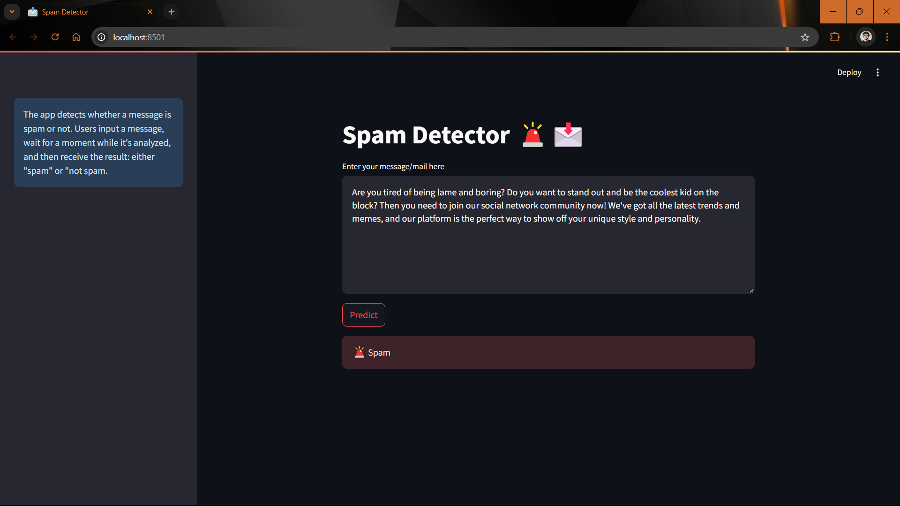
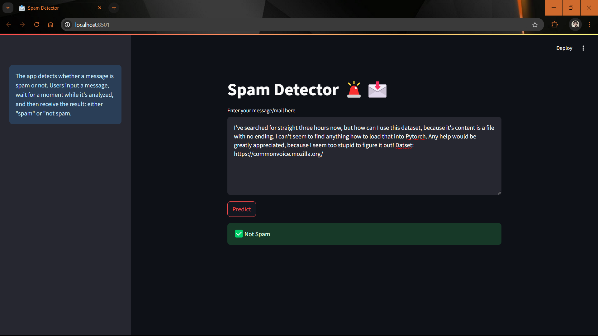

# Spam Detector
Spam detection is the process of identifying unwanted or unsolicited messages, often found in email, text messages, or 
social media, and filtering them out from legitimate communications. By analyzing text patterns, sender information, and 
other metadata, spam detection models, commonly powered by machine learning and natural language processing, classify messages 
as either "spam" or "not spam." Effective spam detection helps prevent phishing attacks, reduce inbox clutter, and protect users from potential scams and harmful content.
### Text classification
This [model](https://huggingface.co/vishnun0027/Spam-Detection) is a fine-tuned version of [google-bert/bert-base-uncased](https://huggingface.co/google-bert/bert-base-uncased) on an [spam-detection](https://huggingface.co/datasets/vishnun0027/spam-detection) dataset.
It achieves the following results on the evaluation set:
- Loss: 0.0202
- Accuracy: 0.9967


  
## Screenshots
<div style="display: flex; justify-content: space-around;">
    <div>
        <p>SPAM</p>
        
    </div>
    <div>
        <p>NOT SPAM</p>
        
    </div>
</div>

## Setup

1. Clone this repository:
   ```sh
   git https://github.com/vishnun0027/Spam-Detector.git
   ```
2. Install the required dependencies:
   ```sh
   pip install -r requirements.txt
   ```
3. Run the Streamlit app:
   ```sh
   streamlit run app.py

   ```
   


